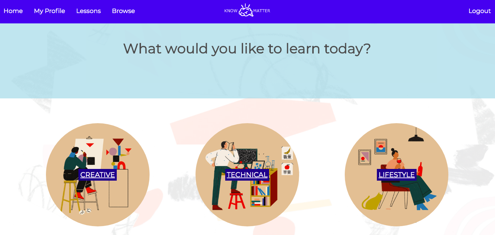
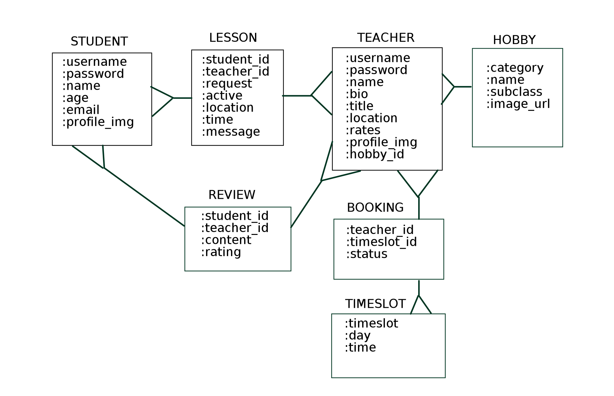

# KNOW MATTER App
------
**Final Project for [Flatiron School](https://flatironschool.com/) Module 2 (Ruby on Rails)**

## PROJECT DESCRIPTION

### Goal
Building an application where students can find tutors of various hobbies, and teachers can post their hobbies to recruit students. As students of Flatiron School, we came to value the one-on-one teaching sessions with our instructors. There are various applications to find group lessons nearby, but we wanted to build something specifically for individual tutoring sessions. 

### Functions 
Know Matter is a double authentication application, meaning a user can sign in either as a student or a teacher. The authentication will permit or deny access to certain actions and URL's based on the user's session type. 
* As a **student**, you can either _login_ (with authenticated username & password) or _signup_, _browse_ different hobbies, browse teachers, _book_ and _request_ to cancel lessons, and see all your _existing lessons_. 
* As a **teacher**, you have the same initialization functions (login or signup) with an additional feature of being able to _create a new hobby_ during the initial signup, can _browse_ other hobbies on the site, _add timeslots_ to your tutor sessions, _confirm_ or _deny_ students' lesson requests or cancellations. 
* Other features include messaging feature (both student and teacher will get notification of either lesson request, cancellation or confirmation in their home page) and validations on the creation and update of both users.

## PROJECT REQUIREMENTS

1. Have at least 5 models. 
2. Have at least 20 methods total in the models. They are to be used to better extract data from the tables. 
3. Analytical component to the application (write some interesting ActiveRecord queries) 
4. No JavaScript. Stay focused on Rails for this project. 

Time allocated: 5 days 

## MODEL FLOW CHART

### Collaborator:
[@ekatsuta](https://github.com/ekatsuta)
